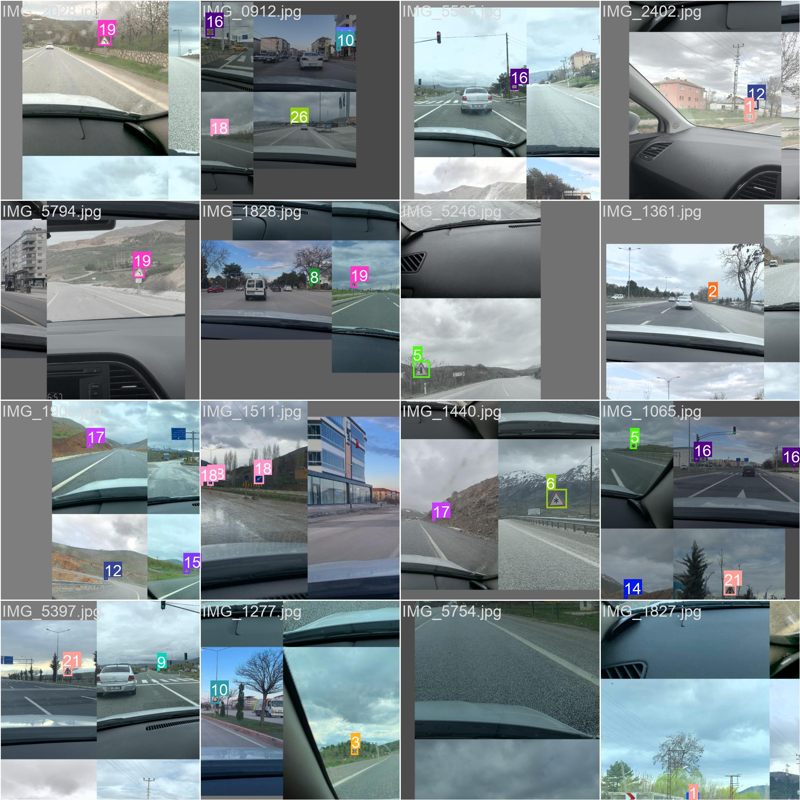
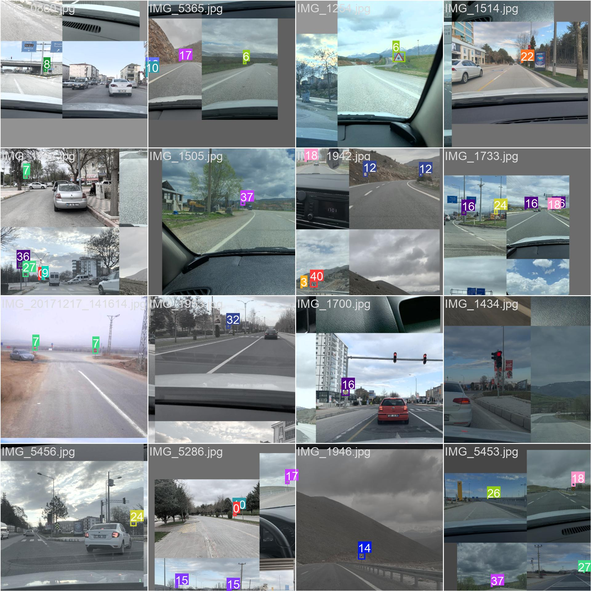
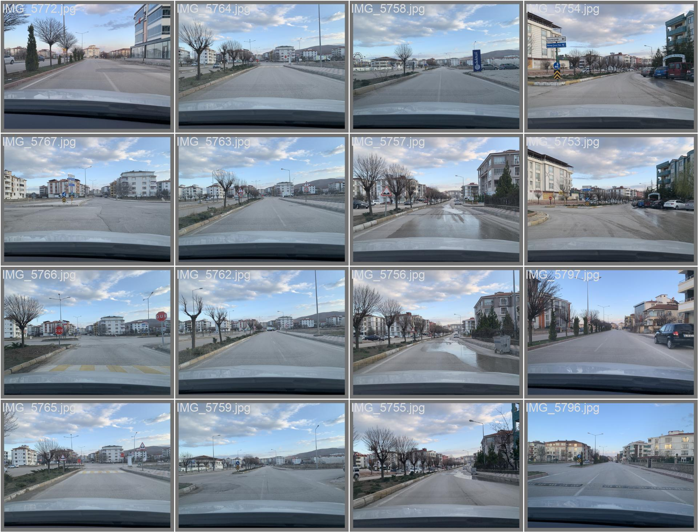
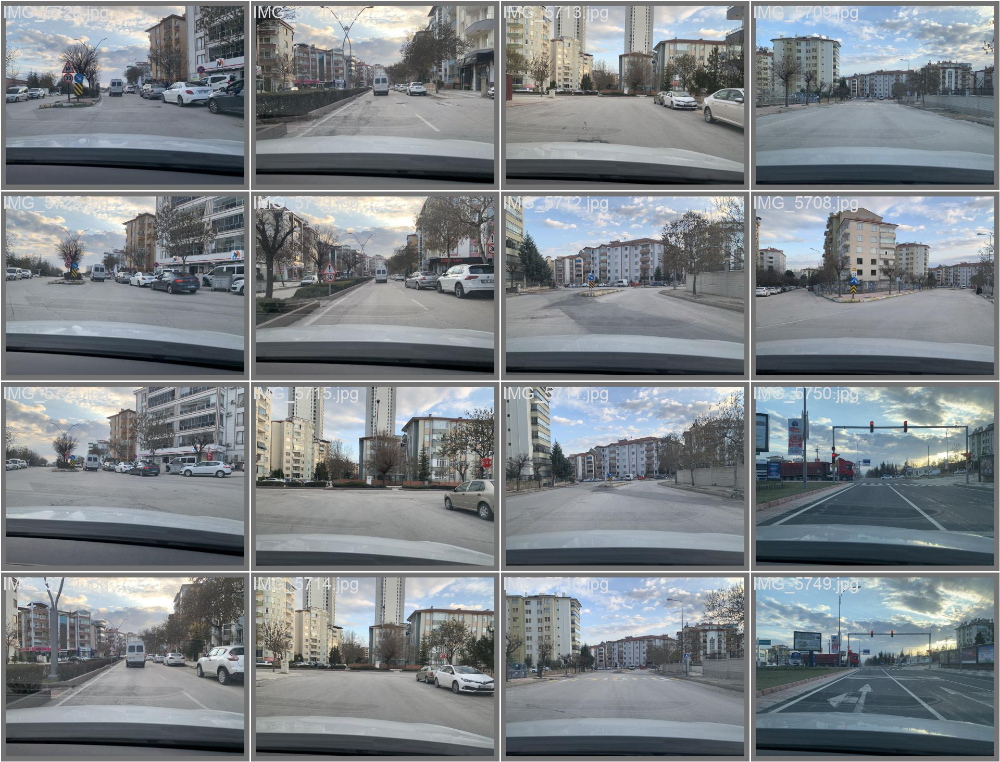
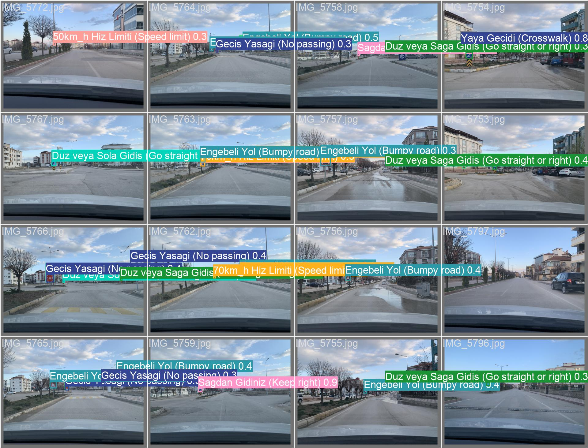
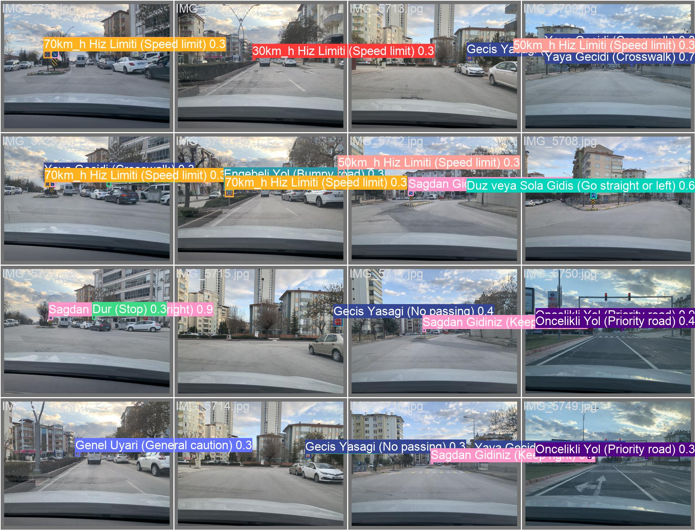

# Trafik İşaretleri Tanıma Sistemi

## Mühendislikte Disiplinlerarası Proje Dersi

**Hazırlayanlar:**
- **Can Çebi**
- **Ege Doğru**
- **Emre Şenel**

**İstanbul Arel Üniversitesi, 4. Sınıf Öğrencileri**

---

## İçindekiler

1. [Proje Hakkında](#1-proje-hakkında)
2. [Veri Seti ve Kaynak](#2-veri-seti-ve-kaynak)
3. [Gerekli Kütüphaneler ve Kurulum](#3-gerekli-kütüphaneler-ve-kurulum)
4. [Proje Yapısı](#4-proje-yapısı)
5. [Flask ile Web Arayüzü Oluşturma](#5-flask-ile-web-arayüzü-oluşturma)
6. [YoloV5 Entegrasyonu](#6-yolov5-entegrasyonu)
   - [6.1. YoloV5 Kurulumu](#61-yolov5-kurulumu)
   - [6.2. Modelin Python ile Kullanımı](#62-modelin-python-ile-kullanımı)
7. [Veri Setinin Hazırlanması ve Eğitimi](#7-veri-setinin-hazırlanması-ve-eğitimi)
   - [7.1. Veri Seti Düzenlemesi](#71-veri-seti-düzenlemesi)
   - [7.2. `data.yaml` Dosyasının Oluşturulması](#72-datayaml-dosyasının-oluşturulması)
   - [7.3. XML'den Yolo Formatına Dönüşüm](#73-xmlden-yolo-formatına-dönüşüm)
   - [7.4. Modelin Eğitimi](#74-modelin-eğitimi)
8. [Sonuçların Görüntülenmesi ve Sesli Çıktı](#8-sonuçların-görüntülenmesi-ve-sesli-çıktı)
9. [Proje Dizin Yapısı](#9-proje-dizin-yapısı)
10. [Kaynakça](#10-kaynakça)

---

## 1. Proje Hakkında

Bu proje, **trafik işaretlerini gerçek zamanlı olarak tanıyabilen bir sistem** geliştirmeyi amaçlamaktadır. Proje kapsamında:

- **OpenCV** ve **YoloV5** kullanılarak trafik işaretleri tespit edilmekte,
- **Pyttsx3** kütüphanesi ile tespit edilen işaretler sesli olarak ifade edilmekte,
- Kullanıcı arayüzü **Flask** web framework'ü ile oluşturulmuştur.

---

## 2. Veri Seti ve Kaynak

Projemizde kullanılan veri seti, **Fırat Üniversitesi Büyük Veri ve Yapay Zeka Laboratuvarı**'nın [**Veri Setleri**](http://buyukveri.firat.edu.tr/veri-setleri/) bölümünden indirilmiştir. Bu veri seti:

- **1250 adet çekilmiş görüntü** içermektedir ve eğitim için kullanılmıştır.
- **41 farklı trafik işareti etiketini** kapsamaktadır.

Akademik çalışmalarda kaynak belirtmek önemli olduğundan, veri setini sağlayan **Fırat Üniversitesi Büyük Veri ve Yapay Zeka Laboratuvarı**'na teşekkür ederiz.

---

## 3. Gerekli Kütüphaneler ve Kurulum

Projenin çalışabilmesi için aşağıdaki Python kütüphanelerinin kurulması gerekmektedir:

- **Flask**: Web uygulaması oluşturmak için.
- **OpenCV**: Görüntü işleme için.
- **Pyttsx3**: Sesli çıktı için.
- **YoloV5**: Trafik işaretlerini tanımak için derin öğrenme modeli.

**Kurulum için aşağıdaki komutu terminalde çalıştırabilirsiniz:**

```bash
pip install Flask opencv-python pyttsx3 torch torchvision pandas numpy tqdm PyYAML requests
```

---

## 4. Proje Yapısı

Proje dosyaları ve klasörleri aşağıdaki gibi yapılandırılmıştır:

```
TrafikIsaretleriTanima/
├── .venv/
├── static/
│   ├── css/
│   │   └── style.css
│   └── js/
│       └── script.js
├── templates/
│   └── index.html
├── traffic_signs_dataset_v1/
│   ├── images/
│   │   ├── train/           # Eğitim görüntüleri (JPG)
│   │   └── val/             # Doğrulama görüntüleri (JPG)
│   ├── labels/
│   │   ├── train/           # Eğitim etiketleri (TXT - Yolo formatı)
│   │   └── val/             # Doğrulama etiketleri (TXT - Yolo formatı)
│   ├── data.yaml            # Yolo eğitim konfigürasyon dosyası
│   └── label_map.pbtxt      # Sınıf haritası
├── yolov5_model/            # YoloV5 dosyaları (model eğitimi için)
├── main.py                  # Flask uygulama kodu
├── xml_to_yolo_converter.py # XML'den Yolo'ya dönüştürücü script
└── README.md
```

---

## 5. Flask ile Web Arayüzü Oluşturma

**`main.py`** dosyasını oluşturup aşağıdaki kodu ekleyin:

```python
from flask import Flask, render_template, Response
import cv2

app = Flask(__name__)

# OpenCV ile kamerayı başlatıyoruz
camera = cv2.VideoCapture(0)

def generate_frames():
    while True:
        success, frame = camera.read()  # Kameradan görüntü al
        if not success:
            break
        else:
            ret, buffer = cv2.imencode('.jpg', frame)
            frame = buffer.tobytes()
            yield (b'--frame\r\n'
                   b'Content-Type: image/jpeg\r\n\r\n' + frame + b'\r\n')

@app.route('/')
def index():
    return render_template('index.html')

@app.route('/video_feed')
def video_feed():
    return Response(generate_frames(), mimetype='multipart/x-mixed-replace; boundary=frame')

if __name__ == "__main__":
    app.run(debug=True)
```

**`templates/index.html`** dosyasını oluşturup aşağıdaki kodu ekleyin:

```html
<!DOCTYPE html>
<html lang="tr">
<head>
    <meta charset="UTF-8">
    <title>Trafik İşareti Tanıma</title>
</head>
<body>
    <h1>Canlı Kamera Akışı</h1>
    
</body>
</html>
```

Bu adımda, web arayüzü oluşturulmuş ve kamera akışı web sayfasına entegre edilmiştir.

---

## 6. YoloV5 Entegrasyonu

### 6.1. YoloV5 Kurulumu

YoloV5 modelini projenize eklemek için aşağıdaki adımları izleyin:

```bash
git clone https://github.com/ultralytics/yolov5 yolov5_model/
```

**Model ağırlıklarını indirin:**

```bash
cd yolov5_model
mkdir weights
wget https://github.com/ultralytics/yolov5/releases/download/v6.0/yolov5s.pt -P weights/
```

### 6.2. Modelin Python ile Kullanımı

**`main.py`** dosyanızı aşağıdaki şekilde güncelleyin:

```python
import torch
from flask import Flask, render_template, Response
import cv2
import pyttsx3
import time
from multiprocessing import Process, Queue

# Flask uygulaması
app = Flask(__name__)

# OpenCV ile kamerayı başlat
camera = cv2.VideoCapture(0)
camera.set(cv2.CAP_PROP_FRAME_WIDTH, 1920)
camera.set(cv2.CAP_PROP_FRAME_HEIGHT, 1080)

# YoloV5 modelini yükle
model = torch.hub.load('yolov5_model', 'custom', path='yolov5_model/weights/best.pt', source='local')

# Zamanlama için değişkenler
last_console_print_time = 0

# Sesli çıktı için kuyruk
label_queue = Queue()

def speech_process(label_queue):
    engine = pyttsx3.init()
    engine.setProperty('voice', 'tr')  # Türkçe dil desteği

    last_speech_time = time.time()
    detected_labels = set()
    while True:
        # 3 saniye boyunca etiketleri topla
        try:
            while True:
                # Non-blocking get with timeout
                label = label_queue.get(timeout=0.1)
                detected_labels.add(label)
        except:
            # Kuyrukta başka etiket yok
            pass

        current_time = time.time()
        if current_time - last_speech_time >= 3:
            if detected_labels:
                # İlk tespit edilen etiketi seslendir
                label_to_speak = next(iter(detected_labels))
                engine.say(label_to_speak)
                engine.runAndWait()
                detected_labels.clear()
            last_speech_time = current_time
        time.sleep(0.1)  # CPU kullanımını azaltmak için küçük bir gecikme

def generate_frames():
    global last_console_print_time
    while True:
        # Kameradan görüntü al
        success, frame = camera.read()
        if not success:
            print("Kameradan görüntü alınamadı.")
            break
        else:
            # YoloV5 ile görüntüyü işle
            results = model(frame)

            # Etiketleri ve koordinatları al
            labels, cords = results.xyxyn[0][:, -1], results.xyxyn[0][:, :-1]
            current_time = time.time()
            y_offset = 50  # Etiketlerin çerçevede gösterileceği başlangıç noktası

            for label, cord in zip(labels, cords):
                x1, y1, x2, y2, conf = cord
                if conf > 0.3:  # Güven skoru filtresi
                    x1, y1, x2, y2 = int(x1 * frame.shape[1]), int(y1 * frame.shape[0]), int(x2 * frame.shape[1]), int(y2 * frame.shape[0])
                    label_name = results.names[int(label)]

                    # Çerçeve ve etiket çiz
                    cv2.rectangle(frame, (x1, y1), (x2, y2), (0, 255, 0), 2)
                    cv2.putText(frame, label_name, (x1, y1 - 10), cv2.FONT_HERSHEY_SIMPLEX, 0.9, (36, 255, 12), 2)

                    # Etiketi ses kuyruğuna ekle
                    label_queue.put(label_name)

                    # Konsola her 1 saniyede bir yazdır
                    if current_time - last_console_print_time >= 1:
                        print(f"Algılanan nesne: {label_name}")
                        last_console_print_time = current_time

                    # Etiketleri web sayfasında göster
                    cv2.putText(frame, f"Tespit: {label_name}", (10, y_offset), cv2.FONT_HERSHEY_SIMPLEX, 1, (0, 0, 255), 2)
                    y_offset += 30  # Bir sonraki etiket için y koordinatını güncelle

            # Çerçeveyi tarayıcıya gönder
            ret, buffer = cv2.imencode('.jpg', frame)
            if ret:
                frame = buffer.tobytes()
                yield (b'--frame\r\n'
                       b'Content-Type: image/jpeg\r\n\r\n' + frame + b'\r\n')

@app.route('/')
def index():
    return render_template('index.html')

@app.route('/video_feed')
def video_feed():
    return Response(generate_frames(), mimetype='multipart/x-mixed-replace; boundary=frame')

if __name__ == "__main__":
    # Sesli çıktıyı başlat
    p = Process(target=speech_process, args=(label_queue,))
    p.start()

    try:
        # Flask sunucusunu başlat
        print("Flask sunucusu başlatılıyor... Tarayıcınızda http://127.0.0.1:5000 adresine gidin.")
        app.run(host='0.0.0.0', port=5000, debug=False)
    finally:
        # Uygulama kapatıldığında ses sürecini sonlandır
        p.terminate()
        p.join()
```

---

## 7. Veri Setinin Hazırlanması ve Eğitimi

### 7.1. Veri Seti Düzenlemesi

- **Görüntüleri düzenleme**: İndirdiğimiz veri setindeki `.jpg` dosyalarını `images/train` ve `images/val` klasörlerine taşıdık.
- **Etiket dosyalarını düzenleme**: `.xml` etiket dosyalarını `labels/train` ve `labels/val` klasörlerine yerleştirdik.

### 7.2. `data.yaml` Dosyasının Oluşturulması

`traffic_signs_dataset_v1` klasörüne `data.yaml` dosyasını oluşturduk:

```yaml
train: ../traffic_signs_dataset_v1/images/train
val: ../traffic_signs_dataset_v1/images/val

nc: 41  # Sınıf sayısı

names:
  0: "30km/h Hız Limiti"
  1: "50km/h Hız Limiti"
  2: "60km/h Hız Limiti"
  3: "70km/h Hız Limiti"
  4: "90km/h Hız Limiti"
  5: "Bir Sonraki Kavşakta Geçiş Hakkı"
  6: "Buzlanma"
  7: "Dur"
  8: "Düz veya Sağa Gidiş"
  9: "Düz veya Sola Gidiş"
  10: "Engebeli Yol"
  11: "Geçiş Yasağı Sonu"
  12: "Geçiş Yasağı"
  13: "Genel Uyarı"
  14: "Sağa Sürekli Tehlikeli Viraj"
  15: "Kaygan Yol"
  16: "Öncelikli Yol"
  17: "Sağa Tehlikeli Viraj"
  18: "Sağdan Gidiniz"
  19: "Sola Tehlikeli Viraj"
  20: "Soldan Gidiniz"
  21: "Trafik Işıkları"
  22: "Yayalar"
  23: "Yol Çalışması"
  24: "Yol Ver"
  25: "Zorunlu Döner Kavşak"
  26: "U Dönüşü"
  27: "U Dönüşü Yasak"
  28: "Gevşek Yamaç"
  29: "4.80m'den Yüksek Araç Giremez"
  30: "Gevşek Malzemeli Yol"
  31: "Ehli Hayvan Geçebilir"
  32: "Yaya Geçidi"
  33: "Duraklamak ve Park Etmek Yasaktır"
  34: "Her İki Yandan Gidiniz"
  35: "Sola Sürekli Tehlikeli Viraj"
  36: "Okul Geçidi"
  37: "EDS"
  38: "Eğimli Yol"
  39: "Yol Daralması"
  40: "Sağdan Ana Yola Giriş"
```

### 7.3. XML'den Yolo Formatına Dönüşüm

`xml_to_yolo_converter.py` scriptini oluşturup XML etiket dosyalarını Yolo formatına dönüştürdük:

```python
import xml.etree.ElementTree as ET
import os

def convert_to_yolo_format(xml_file, output_txt_path, label_map, img_width, img_height):
    # Dönüşüm kodları...
    pass

# Dizinleri belirtin
xml_dir = 'traffic_signs_dataset_v1/labels/train/'
output_txt_dir = 'traffic_signs_dataset_v1/labels/train_yolo/'

os.makedirs(output_txt_dir, exist_ok=True)

# Label map'i yükleyin
label_map = {
    0: "30km/h Hız Limiti",
    1: "50km/h Hız Limiti",
    # Diğer sınıflar...
}

# Tüm XML dosyalarını işleyin
for xml_file in os.listdir(xml_dir):
    if xml_file.endswith('.xml'):
        xml_path = os.path.join(xml_dir, xml_file)
        # Dönüşüm işlemi...
        pass
```

### 7.4. Modelin Eğitimi

YoloV5 modelini eğitmek için aşağıdaki komutu kullandık:

```bash
cd yolov5_model
python train.py --img 1280 --batch 8 --epochs 50 --data ../traffic_signs_dataset_v1/data.yaml --weights yolov5m.pt --cache --noval
```

## 7.5 Model Eğitim Sonuçları

YoloV5 modelinin eğitimi tamamlandıktan sonra, modelin hem eğitim hem de doğrulama veri setlerinde gösterdiği performans incelendi. Aşağıda, bu veri setleri üzerindeki bazı tespit sonuçlarını gösteren görseller bulunmaktadır.

| Eğitim Kümesi Parti 0 | Eğitim Kümesi Parti 1 |
| --- | --- |
|  |  |

| Doğrulama Kümesi Parti 1 Gerçek Etiketler | Doğrulama Kümesi Parti 2 Gerçek Etiketler |
| --- | --- |
|  |  |

| Doğrulama Kümesi Parti 1 Tahmin Edilen Etiketler | Doğrulama Kümesi Parti 2 Tahmin Edilen Etiketler |
| --- | --- |
|  |  |


---

## 8. Sonuçların Görüntülenmesi ve Sesli Çıktı

Eğitilmiş modelimizi kullanarak gerçek zamanlı trafik işareti tespiti yaptık ve sonuçları web arayüzünde görüntüledik. Ayrıca, **Pyttsx3** kütüphanesi ile tespit edilen trafik işaretlerini sesli olarak duyabildik.

---

## 9. Proje Dizin Yapısı

Projenin genel dizin yapısı aşağıdaki gibidir:

```
TrafikIsaretleriTanima/
├── .venv/
├── static/
│   ├── css/
│   │   └── style.css
│   └── js/
│       └── script.js
├── templates/
│   └── index.html
├── traffic_signs_dataset_v1/
│   ├── images/
│   │   ├── train/
│   │   └── val/
│   ├── labels/
│   │   ├── train/
│   │   └── val/
│   ├── data.yaml
│   └── label_map.pbtxt
├── yolov5_model/
├── main.py
├── xml_to_yolo_converter.py
└── README.md
```

---

## 10. Kaynakça

- **Fırat Üniversitesi Büyük Veri ve Yapay Zeka Laboratuvarı**: [Veri Setleri](http://buyukveri.firat.edu.tr/veri-setleri/)
  - Bu projede kullanılan trafik levhaları veri seti, Fırat Üniversitesi'nin Büyük Veri ve Yapay Zeka Laboratuvarı web sitesinden indirilmiştir. Veri seti, 1250 adet görüntü ve 41 farklı trafik işareti etiketini içermektedir.